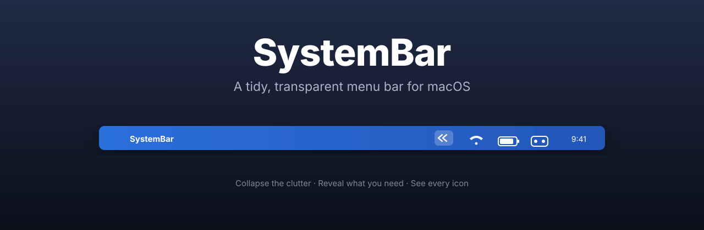
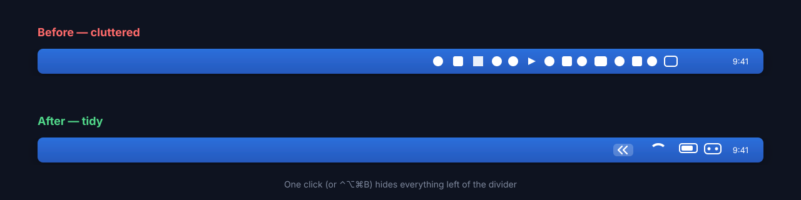
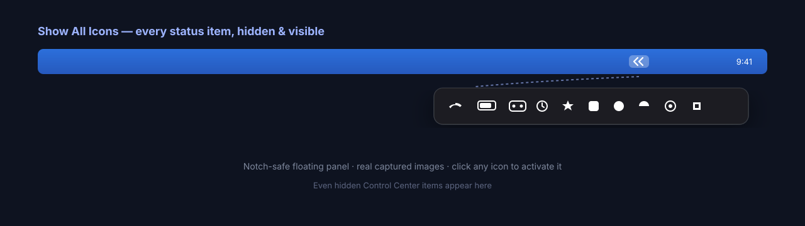

# SystemBar

<p align="center">
  
</p>

A tidy, transparent menu-bar manager for macOS. Collapse the clutter, reveal what
you need, and see *every* icon — including hidden Control Center items — in a
floating, notch-safe panel.


[](https://paypal.me/CuongNguyen557)

> Built because Bartender went closed-source and changed hands in 2024, and the
> MacBook notch keeps swallowing menu-bar icons. SystemBar is free, open source,
> and keeps Screen Recording strictly opt-in.

## Screenshots

**Collapse the clutter** — one click hides everything left of the divider:



**Show All Icons** — a floating, notch-safe panel lists every status item, hidden and visible, with their real captured images:



> Illustrations above are diagrams; a real screen-recorded GIF will replace them in a later release.

## Features

- **Collapse & reveal** menu-bar icons with one click (or `⌃⌥⌘B`) — the proven
  expanding-separator trick, no special permissions needed.
- **Show All Icons** — a floating panel that lists *every* status item, hidden
  and visible, with their real captured images. Notch-safe (it's its own window).
- **Auto-collapse** again after a configurable delay (default 10s).
- **Global hotkey**, **launch at login**, **per-screen** aware.
- **Stable code signing** so granted permissions survive every rebuild.

## Install

### Homebrew (recommended)

```sh
brew install --cask systembar
```

### Manual

Download `SystemBar.app` from [Releases](../../releases), move it to
`/Applications`, and open it.

## Permissions

| Feature | Permission | Why |
|---|---|---|
| Collapse / reveal | none | expanding-separator trick |
| List items in the panel | none | reads the public window list |
| Capture real icon images | Screen Recording | the only way to image another app's status item; **opt-in**, only for the panel |
| Click an item from the panel | Accessibility | synthesizes a click into the owning app |

## How collapsing works

macOS has **no public API** to hide another app's menu-bar icon. The only working
technique is the *expanding separator*:
SystemBar adds a divider; you ⌘-drag it to the right, past the icons you want to
hide; collapsing expands the divider so everything to its left slides off-screen.

> Note: Control Center items (Wi-Fi, Battery, Sound…) can't always be dragged
> past, so use **Show All Icons** to see and click those.

## Build from source

```sh
./scripts/bundle.sh            # → build/SystemBar.app (Apple-Development signed)
open build/SystemBar.app
```

Swift 6 / Xcode 26+, macOS 14+. No external dependencies.

## Support

SystemBar is free and will stay free. If it earns a spot in your menu bar,
[☕ buy me a coffee](https://paypal.me/CuongNguyen557) — it keeps the
project going. Thank you!

## License

[GPLv3](LICENSE). Contributions welcome.
